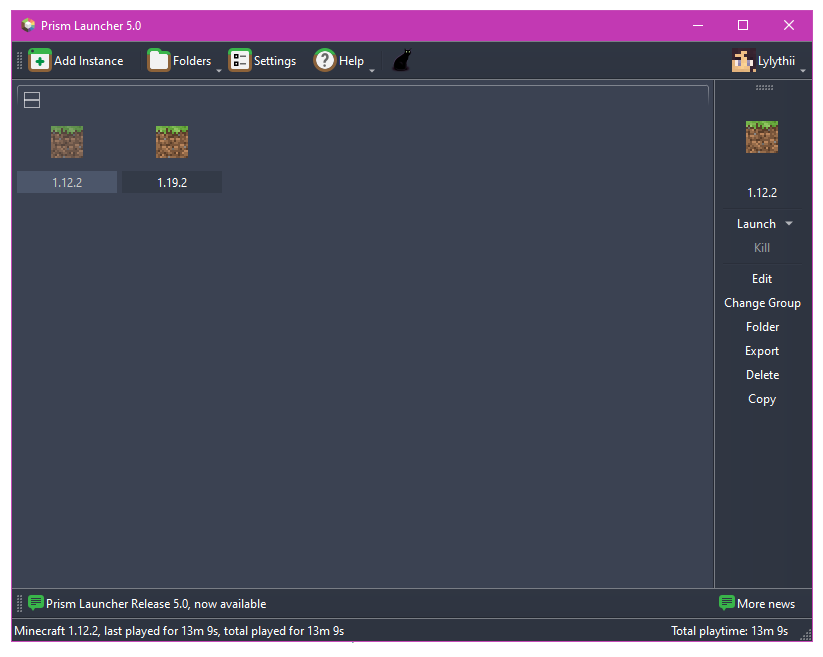
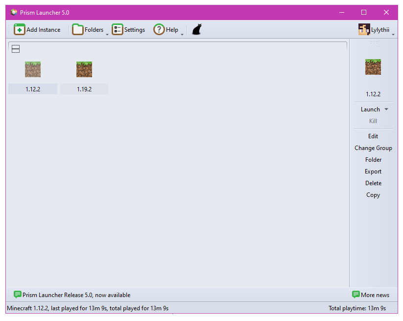

[Moved to official PrismLauncher themes repo.](https://github.com/PrismLauncher/Themes)

### Themes for PrismLauncher.
Also works in MultiMC!

Simply drag & drop the contents of your chosen theme into your PrismLauncher or MultiMC installation & it should be ready to enable.

### Enable Theme

1. Drag `themes` into your PrismLauncher or MultiMC directory & replace the existing files.
2. Launch PrismLauncher or MultiMC.
3. Traverse to `Settings > PrismLauncher > User Interface > Colors`.
4. Select `Custom`.

### Amoled

### Ivy

### Nord - Polar Night

### Nord - Snow Storm

