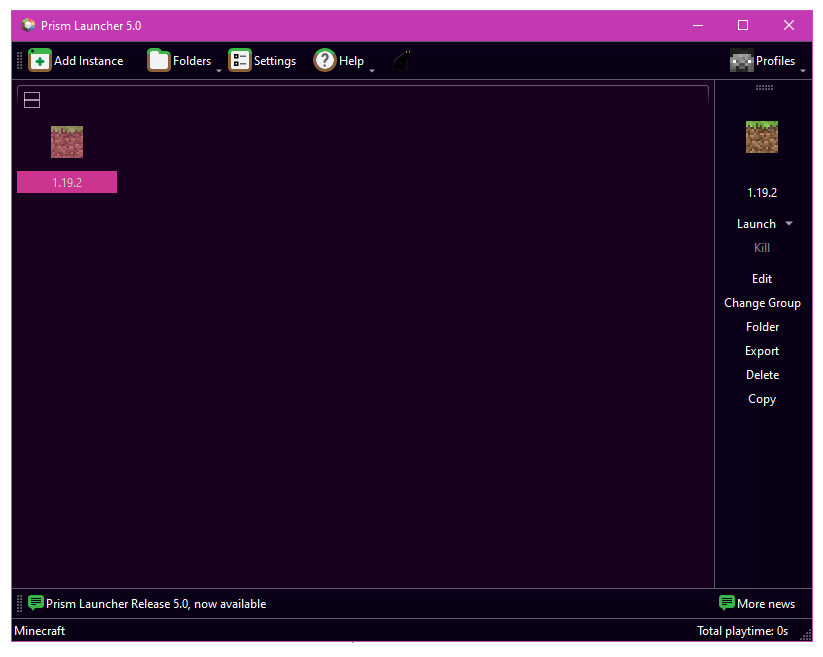

### Themes for PrismLauncher.
Also works in MultiMC!

Simply drag & drop the contents of your chosen theme into your PrismLauncher or MultiMC installation & it should be ready to enable.

### Enable Theme

1. Drag `themes` into your PrismLauncher or MultiMC directory & replace the existing files.
2. Launch PrismLauncher or MultiMC.
3. Traverse to `Settings > PrismLauncher > User Interface > Colors`.
4. Select `Custom`.

### Themes

#### Amoled

#### Ivy

